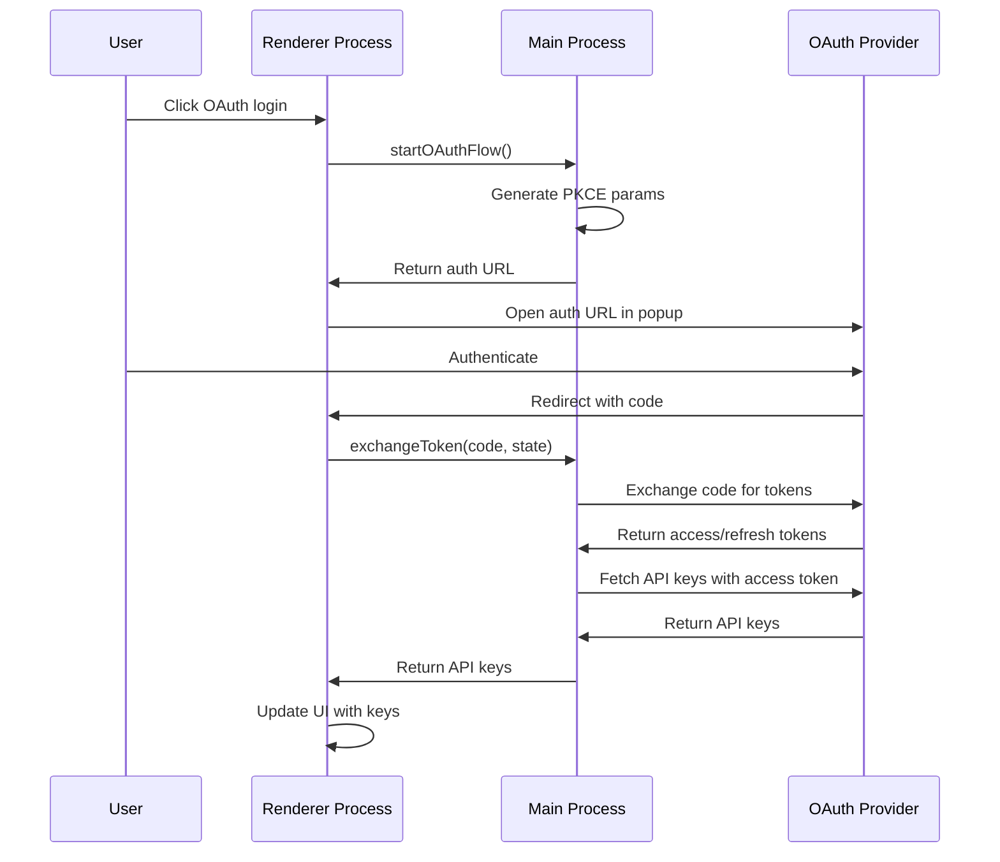
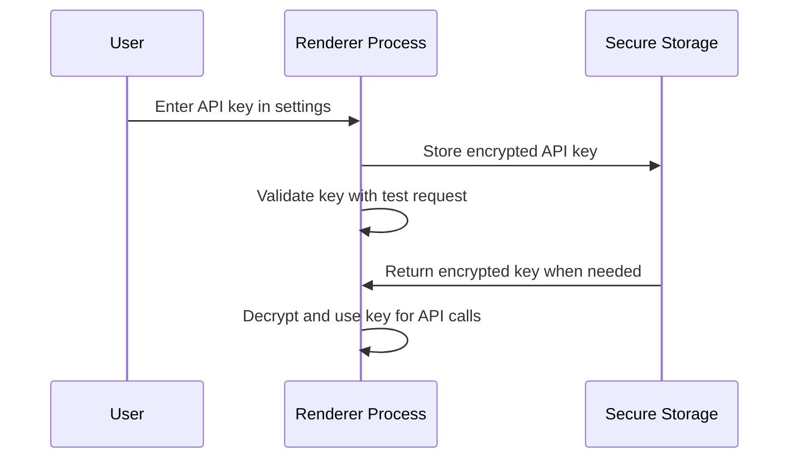

# Cherry Studio Login Methods Explanation

This document explains the two primary login/authentication methods implemented in the Cherry Studio project and their internal data flow processes.

## Method 1: OAuth-Based Authentication

OAuth-based authentication is used for providers that support OAuth 2.0 with PKCE (Proof Key for Code Exchange) flow. The primary implementation is for CherryIN, but similar patterns exist for other providers like SiliconFlow, PPIO, etc.

### Login Process Flow

1. **Initialization**: The user clicks on an OAuth login button in the UI
2. **OAuth Flow Initiation**: The renderer process calls `oauthWithCherryIn()` function in `src/renderer/src/utils/oauth.ts`
3. **PKCE Parameters Generation**: The main process (`src/main/services/CherryINOAuthService.ts`) generates:
   - A cryptographically random `code_verifier` (64 characters)
   - A `code_challenge` derived from the `code_verifier` using SHA-256 hashing
   - A random `state` parameter for CSRF protection
4. **Authorization URL Creation**: An authorization URL is constructed with:
   - Client ID
   - Redirect URI (`cherrystudio://oauth/callback`)
   - Response type (`code`)
   - Scope permissions
   - State parameter
   - Code challenge and method
5. **Browser Popup**: A popup window opens with the authorization URL
6. **User Authentication**: User authenticates on the provider's website
7. **Callback Handling**: After successful authentication, the provider redirects to the custom URI scheme `cherrystudio://oauth/callback` with:
   - Authorization code
   - State parameter
8. **Code Exchange**: The main process exchanges the authorization code for tokens:
   - Sends a POST request to the token endpoint with the code and `code_verifier`
   - Receives access token and refresh token
9. **API Keys Retrieval**: Using the access token, the application fetches the actual API keys from the provider's API
10. **Token Storage**: Tokens are securely stored in the Redux store via IPC communication
11. **UI Update**: The UI is updated with the obtained API keys

### Data Flow Diagram



### Security Features

- **PKCE Implementation**: Prevents authorization code interception attacks
- **State Parameter**: Protects against CSRF attacks
- **Secure Token Storage**: Tokens are stored in the main process Redux store, not in localStorage
- **Automatic Token Refresh**: Refresh tokens are used to obtain new access tokens when they expire
- **Token Revocation**: Proper logout includes revoking tokens on the provider's server

## Method 2: API Key-Based Authentication

API key authentication is a simpler method where users manually enter or paste their API keys into the application.

### Login Process Flow

1. **Key Entry**: User manually enters their API key in the settings UI
2. **Validation**: Application may validate the key by making a test API call to the provider
3. **Storage**: The API key is securely stored in the application's encrypted storage
4. **Usage**: When making API calls, the key is included in the Authorization header:
   ```http
   Authorization: Bearer YOUR_API_KEY
   ```
5. **Rotation Support**: The system supports multiple API keys that can be rotated automatically for better rate limiting

### Data Flow



## Comparison of Methods

| Aspect | OAuth | API Key |
|--------|-------|---------|
| **User Experience** | More complex initial setup, but seamless subsequent use | Simple setup, user must manage key lifecycle |
| **Security** | Higher - tokens are temporary and can be revoked | Lower - keys are long-lived and harder to rotate |
| **Implementation Complexity** | Higher - requires PKCE flow implementation | Lower - simple storage and retrieval |
| **Provider Support** | Requires OAuth 2.0 support | Universal support |
| **Token Management** | Automatic refresh and expiration handling | Manual key rotation required |

## Code Structure Overview

### OAuth Implementation Files:
- `src/renderer/src/utils/oauth.ts` - Frontend OAuth utility functions
- `src/main/services/CherryINOAuthService.ts` - Main process OAuth service with PKCE
- `src/preload/index.ts` - IPC bridge between renderer and main process

### API Key Implementation:
- Various store files in `src/renderer/src/store/` handle API key storage
- Provider configuration files define how keys are used in API calls
- Validation services ensure keys are functional before use

Both methods follow security best practices with tokens/keys stored securely and never exposed to the frontend directly.